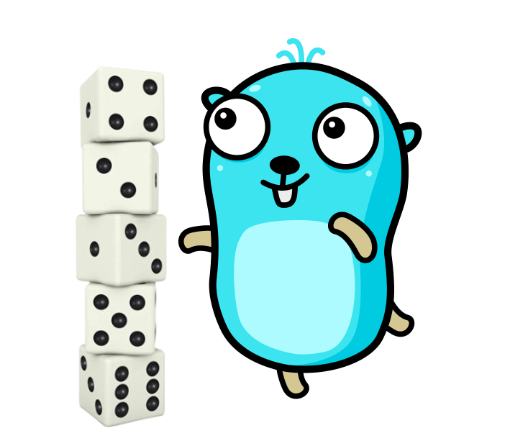

# Imersão Go - Estrutura de Dados

🎲 Códigos do hands on sobre estrutura de dados

Estruturas de dados são formas organizadas e sistemáticas de armazenar e manipular dados em um programa de computador, permitindo que eles sejam acessados, gerenciados e processados de maneira eficiente e eficaz.

Essas estruturas são projetadas para atender a necessidades específicas, como a realização de operações de busca, classificação ou filtragem de dados, e são fundamentais para o desenvolvimento de aplicativos e sistemas computacionais sofisticados.



## Requisitos

- [GoNB](https://github.com/janpfeifer/gonb)
- [Jupyter Notebook](https://jupyter.org/install)

## Instalação

O arquivo `requirements.txt` contém todas as dependências necessárias para rodar o projeto. Para instalar, basta rodar o comando:

```bash
pip install -r requirements.txt
```

Para instalação do kernel do GoNB siga as [instruções do repositório oficial](https://github.com/janpfeifer/gonb?tab=readme-ov-file#installation).

## Como usar

Para rodar o projeto inicie o Jupyter Notebook através do comando `jupyter notebook` e navegue nos arquivos com extensão `.ipynb`.

## Contribuições

Contribuições são bem-vindas. Para mudanças maiores, por favor abra uma issue primeiro para discutir o que você gostaria de mudar.

## Licença

[Creative Commons Zero v1.0 Universal](https://creativecommons.org/publicdomain/zero/1.0/)
